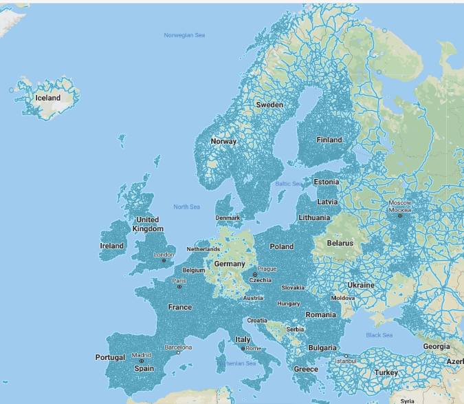

# 🇪🇺 Europe

<figure><figcaption>
Detailed Street View coverage in Europe.
</figcaption></figure>

Generally, it's pretty easy to tell if you're in Europe. The architecture will look older, the road lines will most likely be white, and the standard license plate is elongated and often has a blue stripe on the left side.

## TODO

* [ ] Ireland
* [ ] The U.K.
* [ ] The Isle of Man
* [ ] Jersey
* [ ] Portugal
* [ ] Spain
* [ ] (The Canary Islands)
* [ ] Andorra
* [ ] (Gibraltar)
* [ ] France
* [ ] Belgium
* [ ] The Netherlands&#x20;
* [ ] Luxembourg&#x20;
* [ ] Italy&#x20;
* [ ] San Marino&#x20;
* [ ] Norway&#x20;
* [ ] (Svalbard)&#x20;
* [ ] Sweden&#x20;
* [ ] Finland&#x20;
* [ ] Denmark&#x20;
* [ ] The Faroe Islands&#x20;
* [ ] Iceland&#x20;
* [ ] Greenland&#x20;
* [ ] Germany&#x20;
* [ ] Austria&#x20;
* [ ] Switzerland&#x20;
* [ ] Poland&#x20;
* [ ] Lithuania&#x20;
* [ ] Latvia&#x20;
* [ ] Estonia&#x20;
* [ ] Czechia&#x20;
* [ ] Slovakia&#x20;
* [ ] Slovenia&#x20;
* [ ] Hungary&#x20;
* [ ] Croatia&#x20;
* [ ] Albania&#x20;
* [ ] Greece&#x20;
* [ ] Romania&#x20;
* [ ] Montenegro&#x20;
* [ ] Serbia&#x20;
* [ ] North Macedonia&#x20;
* [ ] Bulgaria&#x20;
* [ ] Ukraine&#x20;
* [ ] Russia&#x20;
* [ ] Malta
