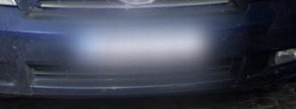
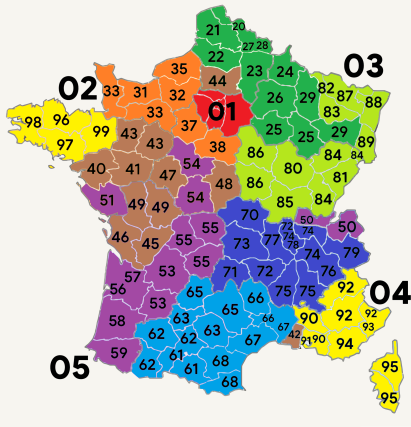

# 🇫🇷 France

## Quick Identifiers

I won't lie, for me the most distinguishing thing in France is the language. If you read it out loud and it sounds like a terrible American bastardization of French, that's probably what it is.

### Bollards

France has _very_ unique bollards for Europe. They are round with a pointy tip, unlike most European bollards which are more flat. Note that Scotland will sometimes have bollards that look similar to the red and white variety, but Scottish bollards are wider.

<figure><figcaption>
This kind has a red reflector strip running around it.
</figcaption></figure>

 

<figure><figcaption>
This kind has a gray reflector strip running around it.
</figcaption></figure>

### Utility Poles

Note that Spain can have similar utility poles to the "ladder pole" below, but they are typically whiter in color. Also, some former French colonies (for instance, Senegal) can have very similar poles. Hopefully, you are not in danger of confusing France and Senegal.

<figure><figcaption>
Note the indents in this version of French utility pole.
</figcaption></figure>

Similar poles to the concrete "holey pole" shown below can be found in Romania, Hungary, and Poland, but these countries' poles usually have fewer holes than the French poles. Turkey can also have holes in their metal utility poles.

<figure><figcaption>
This one is also fairly common.
</figcaption></figure>

### Street Signs

Certain words such as "rue" (street) and "sauf" (except) are often seen on signs and are distinctly french. French signs also typically have a border going around the edge, like so:

<figure><figcaption>
Typical french sign, probably saying something like no parking "except service vehicles"
</figcaption></figure>

<figure><figcaption>
These signs are incredibly French. The yellow rectangle with the road number in it is unique to France.
</figcaption></figure>

### Crossing Sign

<figure><figcaption>
The typical crossing sign has five stripes and looks like this.
</figcaption></figure>

 

<figure><figcaption>
This variant is much rarer, but still exists in France.
</figcaption></figure>

### Roads

<figure><figcaption>
Many French roads have these very long, white dashes along both sides. These long, long dashes are unique in Europe.
</figcaption></figure>

### Architecture

<figure><figcaption>
French towns typically consist of two-storey buildings made out of visible stone. The buildings virtually join one another and are built right on the edge of the footpath.
</figcaption></figure>

### Cars & Plates

The following car brands are quite popular in France.

<figure><figcaption>
Citroen
</figcaption></figure>

 

<figure><figcaption>
Peugeot
</figcaption></figure>

 

<figure><figcaption>
Renault
</figcaption></figure>

<figure><figcaption>
The most common French license plates are just the standard European plate.
</figcaption></figure>

<figure><figcaption>
French plates often have a thick blue stripe on the left and a rather narrow blue stripe on the right.
</figcaption></figure>

 

<figure><figcaption>
Parts of sourthern France are still covered by the gen 2 Street View camera, and may thus include yellow plates.
</figcaption></figure>

## For the Nerds

Probably don't need this to identify France, but hey, if you're an ultra-tryhard...

### Phone Codes

<figure><figcaption>
Telephone prefixes in France. TBH, I mostly know "Paris"  (01) and "Not Paris"
</figcaption></figure>

<figure><figcaption>
Secondary phone codes. For instance, a number might go: 04 72 (Lyon)
</figcaption></figure>

### Town Names

Suffixes can be a good indicator of region. In addition to those mentioned below, French towns ending in ‘-heim’ are likely to be in the east of France, closer to Germany. French towns ending in ‘-az’ are likely to be found in the French alps, typically around Annecy.

<figure><figcaption>
‘Commence par’ means ‘starts with’, ‘Fini end’ means ‘ends with’ and ‘Contient’ means ‘contains’. (Source: Clement Bouchere).
</figcaption></figure>

Many towns in France are situated on a river and this is reflected in their name. In these instances, the town will be called ‘name s/ river’ or ‘name sur river’.

<figure><figcaption>
A town situated on the Loire River
</figcaption></figure>

### Brittany

<figure><figcaption>
The French region of Brittany in north-western France has bilingual road signs featuring both French and Breton.
</figcaption></figure>

 

<figure><figcaption>
The bilingual road signs indicate the French region of Brittany.
</figcaption></figure>

<figure><figcaption>
Houses in Brittany are colored white with dark roofs.
</figcaption></figure>

### Corsica

<figure><figcaption>
The French island of Corsica often has shorter, white dashes on the sides of the road. It also has mountains in the center of the island and a Mediterranean feel elsewhere.
</figcaption></figure>

<figure><figcaption>
Many rear license plates in Corsica are yellow with the vertical, blue left stripe of the standard European plates.
</figcaption></figure>

### Additional Resources for Region-Guessing

* [France’s departements and other stuff.](https://docs.google.com/spreadsheets/d/1H9OMVjgmyLuUD9zcoA9nhfOz4Mrf6C-ydjXFImOd22w/edit#gid=0) (This includes: departements, a sticker cheat sheet, area codes, rivers that share a part of a departement, a wine map, regional metas and general French metas) by Bullfrogggy.
* [A number of maps showing where French town suffixes are distributed throughout France](https://imgur.com/a/blfQT3m) by TontonNestor.
