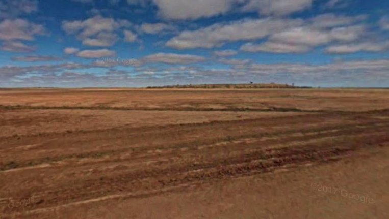
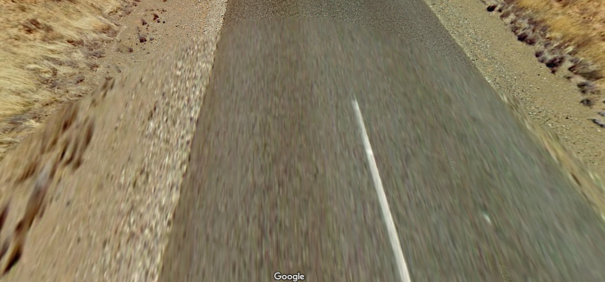
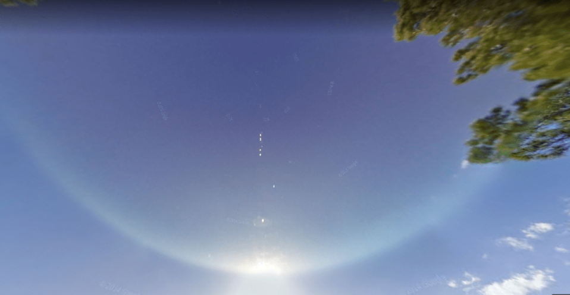
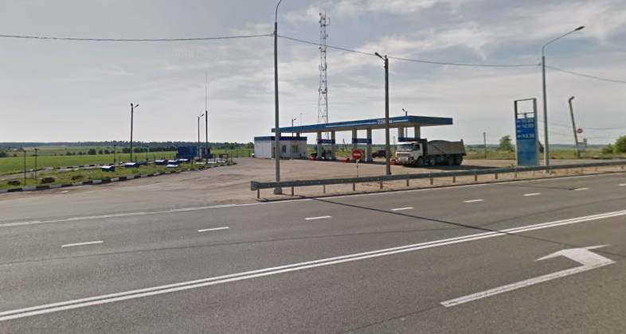
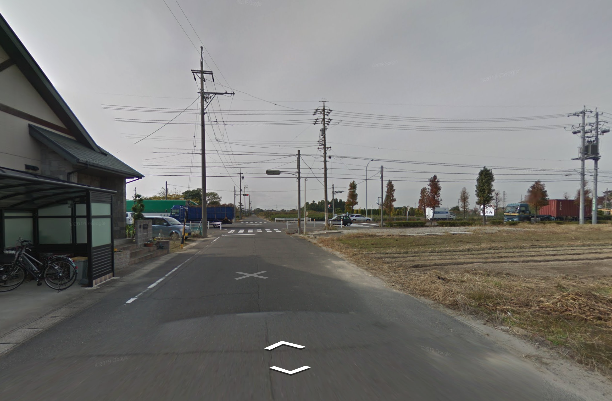

# 📷 Camera Generations

For a more detailed breakdown of which countries use which camera generations, see [this wonderful spreadsheet](https://docs.google.com/spreadsheets/d/1SUcuQkmDgVZMqNLe7XuNEhmJulonpnSQuSiJAOqfhtY/edit#gid=0) by Pro Geoguessr Player Alok.

### Generation 1

If you find yourself questioning whether you need to see an optometrist, it's likely that you're in the US or Australia (as well as potentially New Zealand) and looking at Generation 1 camera footage. Occasionally you will be spawned in a location that seemed to be filmed by a potato— those are mostly in somewhat rural areas in the US (think central) or Australia (where the kangaroos live). Seriously though, some of the locations are downright horrifying.

<figure><figcaption>
This is a less terrifying picture— you're welcome.
</figcaption></figure>

### Generation 2

Gen 2 footage is also quite distinct. Its most distinguishing feature is the wide, perfectly circular blur at the bottom of the screen where the car is, as well as a halo sort of effect around the sun.

<figure><figcaption>
Note the circular blur on the ground.
</figcaption></figure>

 

<figure><figcaption>
A classic example of the sun halo.
</figcaption></figure>

### Generation 3

Gen 3 is a lot more high-definition, but slightly less saturated than Gen 2 and 4 footage. It is incredibly common in most countries, and also includes the most "meta" on the Google car (stuff like the Kenya snorkel, roof rack, etc).

<figure><figcaption>
Generation 3 footage— takes some practice to tell apart from generation 4.
</figcaption></figure>

#### Low Cam

Note that sometimes you'll see an almost circular blur on the bottom— do not mistake this for Gen 2! If the camera appears low to the ground, then you are very likely in Switzerland or Japan, which use cameras lower to the ground (reportedly for privacy issues).&#x20;

<figure><figcaption>
Notice how this Japan footage seems weirdly close to the ground. That's because it is, I guess.
</figcaption></figure>

### Generation 4

Gen 4 produces more vivid colors and with higher clarity than Gen 3.&#x20;

<figure><figcaption>
Generation 4 footage in Singapore.
</figcaption></figure>

### Side-by-Side Comparison

<figure><figcaption>
Generation 1
</figcaption></figure>

 

<figure><figcaption>
Generation 2
</figcaption></figure>

<figure><figcaption>
Generation 3
</figcaption></figure>

 

<figure><figcaption>
Generation 4
</figcaption></figure>

