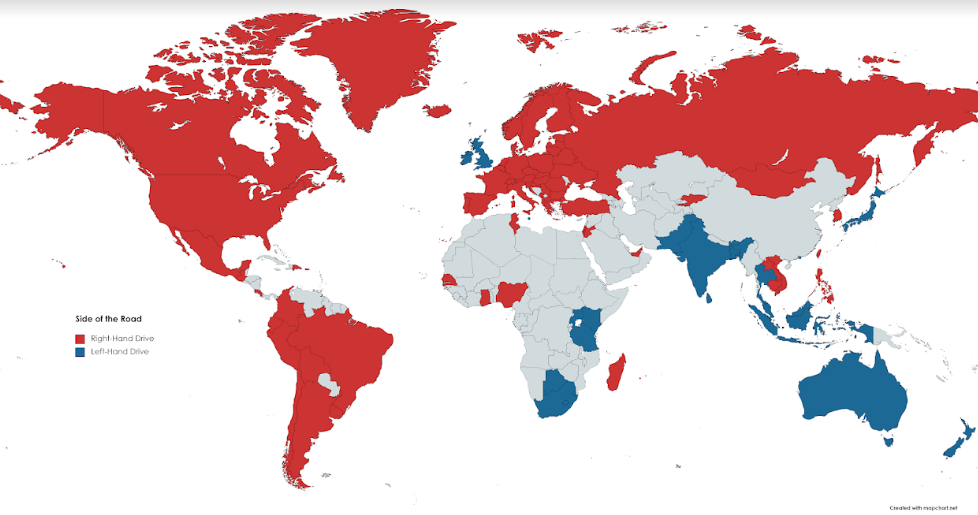

# 🐣 Newbie

Congratulations! You have a life. If you are looking to get some basic knowledge about the game, maybe not embarrass yourself going Australia on a France location, you're in the right place.

## Basic Info

TLDR; guess where u be

At a high level, playing [Geoguessr](https://geoguessr.com/) involves being placed in a "random" spot covered by Google Street View and trying to figure out where exactly you are. But really, there's a lot more to the game than just saying "wow, looks like Indiana" (though that also happens more frequently than you think). Ultimately, it's a game of pattern-recognition, logical deduction, memory, and very little actual geography.

There's a lot of different settings in Geoguessr, roughly corresponding to different levels of masochism. You can set a time limit per round, or make it so that you can't move, pan, or zoom. There are also some competitive game-modes, where you can engage in a proverbial dick-measuring contest with some other poor soul that also memorized the different rooftop water tanks in Turkey.

## Fundamentals

### Look at The Sun

There should be a compass somewhere on your screen. If you're playing a gamemode where you can pan (look around), then check the sun. If the sun is south, the country is likely in the northern hemisphere, and vice versa. This is not a hard and fast rule, but it is often helpful when you have no clue where you are.

Also, for you wonderful inside people, the red bit of the compass points north.

Funnily enough, satellite dishes have a similar effect— because they almost universally point towards a satellite above the equator in geostationary orbit, if satellite dishes point south, it's probably the northern hemisphere, and vice versa.

Finally, if you're extra bitchless, you can look at the shadows on the ground if the sun is obscured by a building or something. Sigh.


TODO: insert image


### Left vs Right Driving

Most of us are self-centered Americans, but believe it or not, different countries drive on different sides of the road. Generally speaking, most countries in North and South America drive right, and the rest of the world is a mix depending on whether or not the country has been unfortunate enough to be colonized by Britain.

<figure><figcaption>
Countries that drive on the right (red) vs left (blue). Image Source: Avery Johnson
</figcaption></figure>

If no cars are around, you can look at which side the street signs are facing. You can also sometimes see the mirrors on the Street View car, which are located on the front, or the aerial antenna thing, which is on the back.&#x20;

## TODO

* [x] Left Right Driving
* [ ] Sun Image
* [ ] Road Lines
